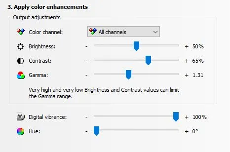

# Nvidia Graphics Filters for Hell Let Loose

Nvidia Control Panel -> Adjust Desktop Color Settings

## Adjusting Desktop Color Settings

Use these with filters or without, it is preference and just an option. Adjust to your liking.

**Important Note:** Filter settings can be subjective and may also depend on your monitor's calibration. Experiment to find what works best for you.

## Nvidia Geforce Experience Overlay workaround:

1. Browse Local files of Hell Let Loose

1. Change Hell Let Loose / HLL.exe to Hell.exe

1. Open Geforce Experience: Check that you have in-game overlay enabled, and experimental features ticked
  
1. Click 3 dots top right (refer video) and scan for games. You **do not** want to see Hell Let Loose in the list

### Video guide:

<video width="100%" controls poster="/videos/nvidia_hll_wa_TN.png">  <!-- Note the leading / -->
  <source src="/videos/nvidia_hll_wa.mp4" type="video/mp4">       <!-- Note the leading / -->
  Your browser does not support the video tag.
</video>
