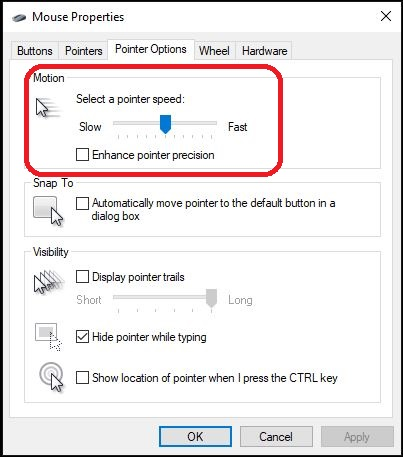

#Windows Basic Settings

##Mouse Settings
**Mouse Properties: Remove Windows mouse acceleration (Windows 10)**

1.  Search Mouse Settings than select Additional Mouse Options
1.  Turn off Enhance Pointer Precision and perferrably do not use a mouse sensitivity over 6. 
1.  Windows will apply its own "mouse acceleration at higher values"

